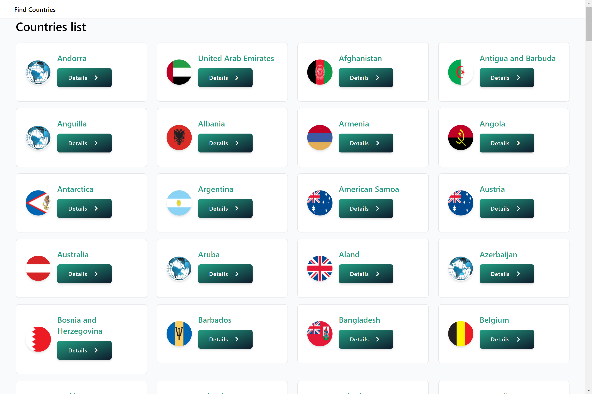

<h1 align="center">Find Countries App</h1><br>
<p align="center">  
Find Countries App is A simple application made in react with Tailwind interface that lists countries from an API made 
in GraphQL
</p>
<br>

<p align="center">
  <a href="https://opensource.org/licenses/Apache-2.0"></a>
</p>

## Screeshots
<hr/> 
<p align="center">
    
</p>

## Tech stack & Open-source libraries
- [Reactjs](https://reactjs.org/) based + [GraphQL](https://graphql.org/) + [Tailwindcss](https://tailwindcss.com/) for User Interface.
- Architecture
    - MVC Architecture
## Challenge and difficulties encountered
* Finding the API was one of the first difficulties.
* The biggest challenge in the realization was the fact that I was swimming in a brand new world ( the one of communication with an API in React).

# License

```
Designed and developed by 2020 roben (Roland Tubongye W.)
Licensed under the Apache License, Version 2.0 (the "License");
you may not use this file except in compliance with the License.
You may obtain a copy of the License at
   http://www.apache.org/licenses/LICENSE-2.0
Unless required by applicable law or agreed to in writing, software
distributed under the License is distributed on an "AS IS" BASIS,
WITHOUT WARRANTIES OR CONDITIONS OF ANY KIND, either express or implied.
See the License for the specific language governing permissions and
limitations under the License.
```
